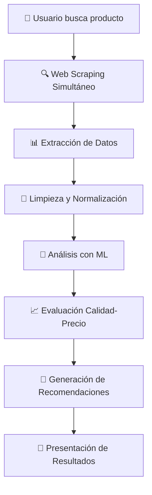

# 🛍️ **Comparador Inteligente de Productos**
### *Plataforma de Análisis Comparativo con Machine Learning*

---

<div align="center">


</div>

---

## 🎯 **Objetivo del Proyecto**

Desarrollar una **plataforma web inteligente** que revolucione la experiencia de compra en línea en Colombia, permitiendo a los usuarios encontrar las mejores opciones de productos mediante **análisis comparativo automatizado** y **recomendaciones basadas en Machine Learning**.

### 🎪 **Misión**
Democratizar el acceso a información comparativa de productos, empoderando a los consumidores colombianos con datos precisos y recomendaciones inteligentes para tomar decisiones de compra informadas.

---

## ✨ **Características Innovadoras**

<table>
<tr>
<td width="50%">

### 🔍 **Búsqueda Inteligente**
- Consulta simultánea en múltiples e-commerce
- Análisis en tiempo real de disponibilidad
- Filtrado avanzado por características

</td>
<td width="50%">

### 🤖 **Recomendaciones ML**
- Algoritmos de análisis calidad-precio
- Evaluación multifactorial de productos
- Personalización basada en preferencias

</td>
</tr>
<tr>
<td>

### 📊 **Análisis Comparativo**
- Visualización de datos comparativos
- Métricas de valor por dinero
- Tendencias de precios y ofertas

</td>
<td>

### ⚡ **Procesamiento Rápido**
- Web scraping optimizado
- Análisis de datos en tiempo real
- Interfaz responsiva y fluida

</td>
</tr>
</table>

---

## 🛠️ **Stack Tecnológico**

### 🚀 **Backend - Núcleo de Procesamiento**
<div align="center">

| Tecnología | Propósito | Descripción |
|------------|-----------|-------------|
|  | **API Framework** | Framework moderno para desarrollo de APIs de alto rendimiento |
|  | **Lenguaje Principal** | Procesamiento de datos, ML y lógica de negocio |
|  | **Inteligencia Artificial** | Modelos de recomendación y análisis predictivo |

</div>

### 🎨 **Frontend - Experiencia de Usuario**
<div align="center">

| Tecnología | Propósito | Descripción |
|------------|-----------|-------------|
|  | **Estructura** | Markup semántico y accesible |
|  | **Diseño** | Estilos modernos y diseño responsivo |
|  | **Interactividad** | Lógica del cliente y comunicación con API |

</div>

---

## 🔬 **Metodologías y Técnicas Implementadas**

### 🕷️ **Web Scraping Avanzado**
```python
🎯 Extracción automatizada de datos de e-commerce
📊 Procesamiento de información de productos en tiempo real  
🔄 Actualización continua de precios y disponibilidad
🛡️ Técnicas anti-detección y manejo de limitaciones
```

### 📈 **Análisis de Datos**
```python
🔍 Limpieza y normalización de datos heterogéneos
📊 Análisis estadístico de características de productos
💹 Evaluación de tendencias de precios y mercado
🎯 Identificación de patrones de calidad-precio
```

### 🤖 **Machine Learning**
```python
🧠 Algoritmos de recomendación personalizada
⚖️ Modelos de evaluación calidad-precio
📊 Análisis predictivo de mejores ofertas
🎯 Clasificación inteligente de productos
```

---

## 🌟 **Flujo de Procesamiento Inteligente**

<div align="center">



</div>

---

## 🎪 **Alcance del Proyecto**

### 🛒 **E-commerce Objetivo**
- **Cobertura**: Los 3 e-commerce más populares de Colombia
- **Categorías**: Electrónicos, hogar, moda, deportes, y más
- **Datos**: Precios, características, valoraciones, disponibilidad

### 📊 **Métricas de Análisis**
- **Relación Calidad-Precio**: Análisis del valor real del producto
- **Valoraciones de Usuarios**: Procesamiento de reseñas y puntuaciones
- **Características Técnicas**: Comparación de especificaciones
- **Factores de Entrega**: Tiempos, costos y disponibilidad

---

## 🔮 **Innovaciones Técnicas**

### 🧠 **Algoritmos Propios**
- **Índice de Valor**: Métrica personalizada calidad-precio
- **Scoring Inteligente**: Evaluación multidimensional de productos
- **Recomendación Adaptativa**: Aprendizaje de preferencias del usuario

### ⚡ **Optimizaciones**
- **Scraping Paralelo**: Extracción simultánea de múltiples fuentes
- **Caché Inteligente**: Optimización de consultas repetitivas
- **Procesamiento Asíncrono**: Respuestas rápidas sin bloqueos

---

## 🎓 **Contexto Académico**

<div align="center">

**📚 Proyecto de Grado**  
*Ingeniería de Sistemas / Ciencias de la Computación*

**🎯 Línea de Investigación**  
*Inteligencia Artificial Aplicada al Comercio Electrónico*

**🔬 Enfoque**  
*Desarrollo de Soluciones Tecnológicas para Optimización de Decisiones de Compra*

</div>

---

## 🌟 **Impacto Esperado**

### 👥 **Para los Usuarios**
- ⏰ **Ahorro de Tiempo**: Búsqueda unificada en múltiples plataformas
- 💰 **Ahorro de Dinero**: Identificación de las mejores ofertas
- 🎯 **Decisiones Informadas**: Recomendaciones basadas en datos

### 🏢 **Para el Mercado**
- 📊 **Transparencia**: Mayor competencia entre e-commerce
- 🔍 **Insights**: Análisis de tendencias del mercado colombiano
- 🚀 **Innovación**: Impulso a la transformación digital

---

